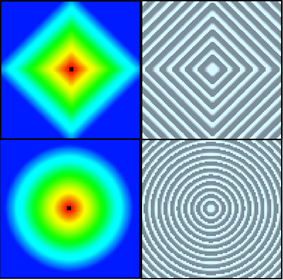
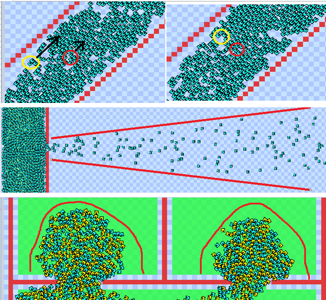

# Continuum Crowds Unity Simulator

Download a Windows build [here](https://github.com/Reascent/ContCrowds_Unity/releases/download/v1.0.0.0/build_v1.0.0.0.zip).

The Continuum Crowds algorithm is a realtime model for crowd movement that is based on fluid dynamics and wave propagation. The model uses a dynamic potential field with global navigation and obstacle avoidance such as other agents.

This approach is directly related to the 2002 Huges model for crowd movement.

Continuum Crowds uses the Huges model to a create flow map to nagivate a group of agents to a shared goal.
The model uses a 'discomfort field' that is based on the agents' density, average velocity and speed as well as the area's local cost, potential and gradient in a way similar to Dijkstra, called the Fast Marching Method. The difference in wave propagation can be seen in the following image, with 4-way Dijkstra on top and FMM at the bottom:

Some emergent effects:

Here are some videos of the simulator in action showing how two groups interact in different conditions:

Emergent lanes:

Getting out of rooms:

Maze navigation:

Sources:

[1]E.W. Dijkstra. A Note on Two Problems in Connexion with Graphs. Numerische Mathematik 1, 269-271, 1959.

[2]Stephen J. Guy, Jatin Chhugani, Sean Curtis, Pradeep Dubey, Ming Lin, and Dinesh Manocha. PLEdestrians: A Least-Effort Approach to Crowd Simulation. Eurographics/ ACM SIGGRAPH Symposium on Computer Animation, 2010. http://gamma.cs.unc.edu/PLE/pubs/PLE.pdf

[3]Dijkstra's algorithm -https://en.wikipedia.org/wiki/Dijkstra%27s_algorithm

[4]Craig W. Reynolds. Flocks, Herds, and Schools: A Distributed Behavioral Model. In Computer Graphics, 25-34, 1987. http://www.red3d.com/cwr/boids/.

[5]P. Hart, N. Nilsson and B. Raphael, A Formal Basis for the Heuristic Determinationof Minimum Cost  Paths. IEEE Trans. Syst. Science and Cybernetics, SSC-4(2), 100-107, 1968. 

[6]Dave Ferguson, Anthony Stentz. Field D*: An Interpolation-Based Path Planner and Replanner. Robotics Research/ Results of the 12th International Symposium ISRR, pp 239-253, 2007.

[7]Elijah Emerson. Crowd Pathfinding and Steering Using Flow Field Tiles. GameAIPro, C23, 307-317, 2013.

[8]Lighthill, M.J., Whitham, G.B., On Kinematic Waves. I: Flood movement in long rivers. Proceedings of the Royal Society of London. Series A. Mathematical and Physical Sciences 229, 1955.

[9]Lighthill, M.J., Whitham, G.B., On Kinematic Waves. II: A theory of traffic flow on long crowded roads. Proceedings of the Royal Society of London. Series A. Mathematical and Physical Sciences 229, 317. 1955.

[10]Traffic Flow -https://en.wikipedia.org/wiki/Traffic_flow

[11]Richards, P., Shock waves on the highway. Operations research 42-51, 1956.

[12]Hughes, R.L., A continuum theory for the flow of pedestrians.Transportation Research Part B 36 (6), 507-535. 2002.

[13]Wardrop, J. G.; Whitehead, J. I., "Correspondence. Some Theoretical Aspects of Road Traffic Research". ICE Proceedings: Engineering Divisions. 1 (5): 767. 1952.

[14]Huang, L., Wong, S., Zhang, M., Shu, C.W., Lam, W., Revisiting Hughes’ dynamic continuum model for pedestrian flow and the development of an efficient solution algorithm. Transportation Research Part B: Methodological 43, 127-141.

[15]James A. Sethian. A Fast Marching Level Set Method for Monotonically Advancing Fronts. In Proc. Nat. Acad. Sci, 1591-1595, 1995. http://www.imm.dtu.dk/~rlar/04351/lectures/LevelSets/1591.pdf

[16]James A. Sethian and Alexander Vladimirsky. OrderedUpwind Methods for Static Hamilton–Jacobi Equations: Theory and Algorithms. SIAM J. Numer. Anal., 41:325–363, 2003.

[17]Bærentzen, J.A., On the implementation of fast marching methods for 3D lattices. Informatics and Mathematical Modeling, Technical University of Denmark. 2001. http://www2.imm.dtu.dk/pubdb/views/edoc_download.php/841/pdf/imm841.pdf

[18]Adrien Treuille, Seth Cooper, and Zoran Popovi ́c. Continuum Crowds. ACM Trans. Graph, 25:1160–1168, 2006. http://grail.cs.washington.edu/projects/crowd-flows/

[19]Clément Pêtrès, Yan Pailhas, Yvan Petillot, and Dave Lane. Underwater Path Planing Using Fast MarchingAlgorithms. IEEE Oceans Europe 2005, June 2005.

[20]Helmut Duregger, Simulation of Large and Dense Crowds on the GPU using OpenCL. Institute of Computer Science, Faculty of Mathematics, Computer Science and Physics, University of Innsbruck. October 18, 2011.

[21]Monima Twarogowska, Paola Goatin, Regis Duvigneau, “Comparative study of macroscopic pedestrian models”, The conference on Pedestrian and Evacuation Dynamics 2014, Transportation Research Procedia2 (2014) 477-485, 2014
